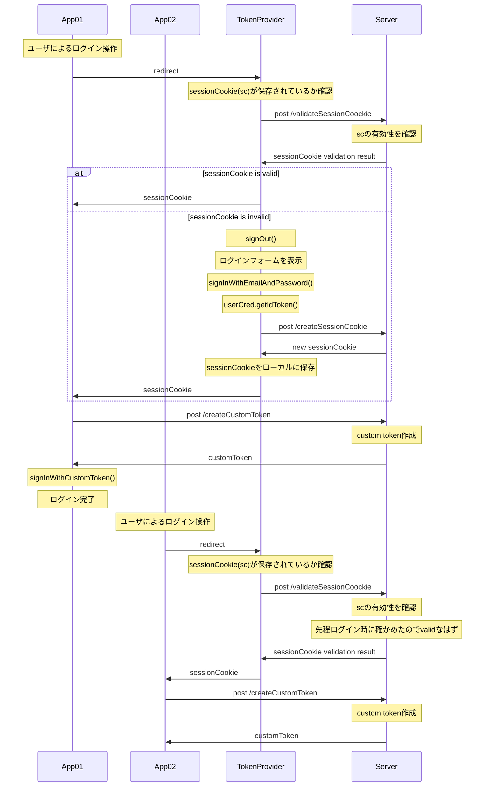

> FirebaseAuthError: Firebase ID token has incorrect "iss" (issuer) claim. Expected "https://securetoken.google.com/fb-auth-sso-test" but got "https://session.firebase.google.com/fb-auth-sso-test". Make sure the ID token comes from the same Firebase project as the service account used to authenticate this SDK. See https://firebase.google.com/docs/auth/admin/verify-id-tokens for details on how to retrieve an ID token.
> at FirebaseAuthError.FirebaseError [as constructor] (/Users/tchi/Dev_private/fb-auth-sso-demo/functions/node_modules/.pnpm/firebase-admin@10.3.0/node_modules/firebase-admin/lib/utils/error.js:44:28)
> at FirebaseAuthError.PrefixedFirebaseError [as constructor] (/Users/tchi/Dev_private/fb-auth-sso-demo/functions/node_modules/.pnpm/firebase-admin@10.3.0/node_modules/firebase-admin/lib/utils/error.js:90:28)
> at new FirebaseAuthError (/Users/tchi/Dev_private/fb-auth-sso-demo/functions/node_modules/.pnpm/firebase-admin@10.3.0/node_modules/firebase-admin/lib/utils/error.js:149:16)
> at FirebaseTokenVerifier.verifyContent (/Users/tchi/Dev_private/fb-auth-sso-demo/functions/node_modules/.pnpm/firebase-admin@10.3.0/node_modules/firebase-admin/lib/auth/token-verifier.js:245:19)
> at /Users/tchi/Dev_private/fb-auth-sso-demo/functions/node_modules/.pnpm/firebase-admin@10.3.0/node_modules/firebase-admin/lib/auth/token-verifier.js:165:19
> at processTicksAndRejections (node:internal/process/task_queues:96:5) {
> errorInfo: {
> code: 'auth/argument-error',
> message: 'Firebase ID token has incorrect "iss" (issuer) claim. Expected "https://securetoken.google.com/fb-auth-sso-test" but got "https://session.firebase.google.com/fb-auth-sso-test". Make sure the ID token comes from the same Firebase project as the service account used to authenticate this SDK. See https://firebase.google.com/docs/auth/admin/verify-id-tokens for details on how to retrieve an ID token.'
> },
> codePrefix: 'auth'
> }
> /Users/tchi/Dev_private/fb-auth-sso-demo/functions/node_modules/.pnpm/firebase-admin@10.3.0/node_modules/firebase-admin/lib/utils/error.js:44
> var \_this = \_super.call(this, errorInfo.message) || this;
> ^

> FirebaseAuthError: Firebase ID token has incorrect "iss" (issuer) claim. Expected "https://securetoken.google.com/fb-auth-sso-test" but got "https://session.firebase.google.com/fb-auth-sso-test". Make sure the ID token comes from the same Firebase project as the service account used to authenticate this SDK. See https://firebase.google.com/docs/auth/admin/verify-id-tokens for details on how to retrieve an ID token.
> at FirebaseAuthError.FirebaseError [as constructor] (/Users/tchi/Dev_private/fb-auth-sso-demo/functions/node_modules/.pnpm/firebase-admin@10.3.0/node_modules/firebase-admin/lib/utils/error.js:44:28)
> at FirebaseAuthError.PrefixedFirebaseError [as constructor] (/Users/tchi/Dev_private/fb-auth-sso-demo/functions/node_modules/.pnpm/firebase-admin@10.3.0/node_modules/firebase-admin/lib/utils/error.js:90:28)
> at new FirebaseAuthError (/Users/tchi/Dev_private/fb-auth-sso-demo/functions/node_modules/.pnpm/firebase-admin@10.3.0/node_modules/firebase-admin/lib/utils/error.js:149:16)
> at FirebaseTokenVerifier.verifyContent (/Users/tchi/Dev_private/fb-auth-sso-demo/functions/node_modules/.pnpm/firebase-admin@10.3.0/node_modules/firebase-admin/lib/auth/token-verifier.js:245:19)
> at /Users/tchi/Dev_private/fb-auth-sso-demo/functions/node_modules/.pnpm/firebase-admin@10.3.0/node_modules/firebase-admin/lib/auth/token-verifier.js:165:19
> at processTicksAndRejections (node:internal/process/task_queues:96:5) {
> errorInfo: {
> code: 'auth/argument-error',
> message: 'Firebase ID token has incorrect "iss" (issuer) claim. Expected "https://securetoken.google.com/fb-auth-sso-test" but got "https://session.firebase.google.com/fb-auth-sso-test". Make sure the ID token comes from the same Firebase project as the service account used to authenticate this SDK. See https://firebase.google.com/docs/auth/admin/verify-id-tokens for details on how to retrieve an ID token.'
> },
> codePrefix: 'auth'
> }

FirebaseAuthError: Firebase ID token has incorrect "iss" (issuer) claim.

Expected "https://securetoken.google.com/fb-auth-sso-test" but got "https://session.firebase.google.com/fb-auth-sso-test".

Make sure the ID token comes from the same Firebase project as the service account used to authenticate this SDK. See https://firebase.google.com/docs/auth/admin/verify-id-tokens for details on how to retrieve an ID token.

## Flows

